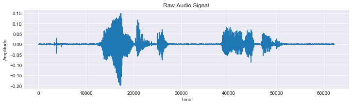
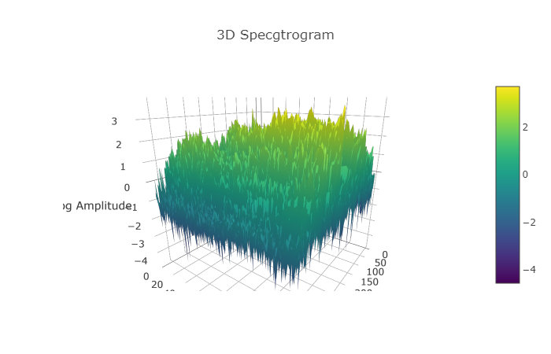
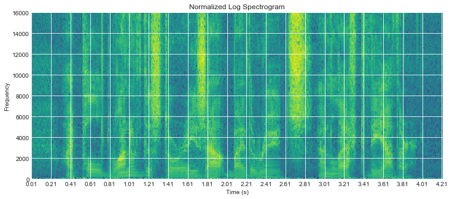
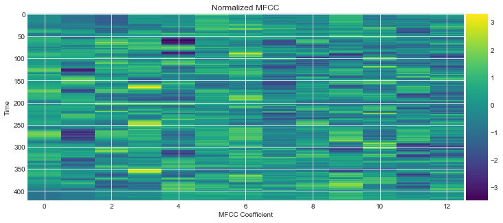
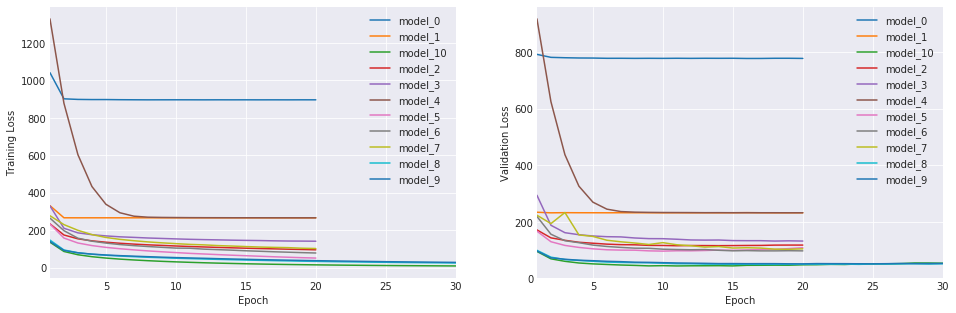

# Hey, Jetson!
## Automatic Speech Recognition Inference
### By Brice Walker

[Check out the inference engine at heyjetson.com](https://heyjetson.com)

[View full notebook on nbviewer](https://nbviewer.jupyter.org/github/bricewalker/Hey-Jetson/blob/master/Speech.ipynb)



This project builds a scalable speech recognition platform in Keras/Tensorflow for inference on the Nvidia Jetson Embedded Computing Platform for AI at the Edge. This is a real world application of automatic speech recognition that was inspired by my career in mental health. This project begins a journey towards building a platform for real time therapeutic intervention inference and feedback. The ultimate intent is to build a tool that can give therapists real time feedback on the efficacy of their interventions, but this has many applications in mobile, robotics, or other areas where cloud based deep learning is not desirable.

The final production model consists of a layer of a deep neural network with 1 layer of convolutional neurons, 2 layers of bidirectional recurrent neurons (GRU cells), and a layer of time distributed dense neurons. This model makes use of a CTC loss function, the Adam optimizer, batch normalization, and bidirectional layers. The model was trained on an Nvidia GTX1070(8G) GPU for 30 epochs for a total training time of roughly 24 hours. The overall cosine similarity of the model's predictions with the ground truth transcriptions in both the test and validation set is about 74%, while the overall word error rate is around 18%.

This project also includes a flask web server for deploying an applied speech inference engine.

## Outline
- [Getting started](#start)
- [Introduction](#intro)
- [Tools](#tools)
- [Dataset](#data)
- [Feature Extraction/Engineering](#features)
- [Recurrent Neural Networks](#rnn)
- [Performance](#performance)
- [Inference](#selection)
- [Conclusion](#conclusion)

<a id='start'></a>
## Getting Started
#### Preparing the dataset
Download the data set from the [LibriSpeech ASR corpus](http://www.openslr.org/12/).

The dataset is prepared using a set of scripts borrowed from [Baidu Research's Deep Speech GitHub Repo](https://github.com/baidu-research/ba-dls-deepspeech).

flac_to_wav.sh converts all flac files to .wav format and create_desc_json.py will create a corpus for each data set out of the original text descriptions:

For this script to work, you will need to obtain the libav package.
Use the following steps for each OS:

Linux: ```sudo apt-get install libav-tools```

Mac: ```brew install libav```

Windows: Browse to the [Libav Website](https://libav.org/download/). Scroll down to "Windows Nightly and Release Builds" and click on the appropriate link for your system (32-bit or 64-bit). Click nightly-gpl. Download the most recent archive file, and extract it. Move the usr directory to your C: drive and run:

```rename C:\usr avconv```
<br>
```set PATH=C:\avconv\bin;%PATH%```

Run flac_to_wav.sh from the directory containing the dataset. This might take a while depending on your machine: ```flac_to_wav.sh```

Now navigate to your code repo and run create_desc_json.py, specifying the path to the dataset and the names for the corpus files, the commands should look like this:

```
python create_desc_json.py C:\Users\brice\LibriSpeech\train-clean-100\ train_corpus.json
python create_desc_json.py C:\Users\brice\LibriSpeech\dev-clean\ valid_corpus.json
python create_desc_json.py C:\Users\brice\LibriSpeech\test-clean\ test_corpus.json
```

And then for training the final model, be sure to download both the train-clean-100, and train-clean-360 datasets and combine them into one folder, named 'train-clean-460' within the LibriSpeech directory, then run the command. It should look something like this:

```python create_desc_json.py C:\Users\brice\LibriSpeech\train-clean-460\ train_corpus.json```

Then run the following command in the repo directory: ```pip install -r server_requirements.txt```
#### Training the model
Install the required libraries and their dependencies with: ```pip install -r jetson_requirements.txt```

You can then run the train_model script to train the full RNN: ```python train_model.py```

Optionally, you can run through the provided notebook in Jupyter for a walk through of the modeling process and an in depth exploration of speech recognition.

> Note: it is recommended that you train the model using a GPU as it will take a very long time on a CPU. To do so, you would need to run:
```pip uninstall tensorflow``` , and then ```pip install tensorflow-gpu``` and ```pip uninstall keras```, and then ```pip install keras-gpu``` in order to take advantage of your graphics card.

#### Preparing the Jetson
In order to prepare the Jetson for deployment of the inference engine, you will need to flash it with the latest version of L4T. It is recommended that you do this by downloading and installing [JetPack 3.2](https://developer.nvidia.com/embedded/jetpack) on an Ubuntu server and then following the included instructions for flashing the Jetson. You will need to make sure to select the options to pre-install [CUDA 9.0](https://developer.nvidia.com/cuda-toolkit), and [cuDNN 7.0.5](https://developer.nvidia.com/cudnn) on to the device. 

You will then need to install pip and python-dev with: ```sudo apt-get install python3-pip python3-dev``` 

#### Running the inference server
It is recommended that you use Python 3.5+ in a virtual environment for the inference engine. To do so, navigate to the project directory and run: ```python -m venv venv```

Then activate the environment with:

Unix/Linux: ```source venv/bin/activate```

Windows: ```venv\Scripts\activate.bat```

Then you can run: ```pip install -r jetson_requirements.txt``` to install all required libraries into the virtual environment. You may need to install some libraries using apt-get: ```sudo apt-get install python3-<libraryname>```

> Note: You will need to build TensorFlow from source on the TX2. Optionally, you can run ```pip install tensorflow-1.5.0-cp35-cp35m-linux_aarch64.whl``` to install the included wheel file that was prebuilt with TensorFlow 1.5.

##### Builidng TensorFlow From Source

To build TensorFlow from source:

Now export the path as an environment variable:

Unix/Linux: ```export FLASK_APP=inference.py```

Windows: ```set FLASK_APP=inference.py```

Finally, initialize the web app with: ```flask run```

Now you can access the inference engine in your browser at [http://127.0.0.1:5000](http://127.0.0.1:5000) or [http://localhost:5000](http://localhost:5000).

<a id='intro'></a>
## Introduction

This end-to-end machine learning project explores methods for preparing audio files for machine learning algorithms, then constructs a series of increasingly complex sequence-to-sequence neural networks for character-level phonetics sequencing models. For this project, I have chosen Recurrent Neural Networks, as they allow us to harness the power of deep neural networks for time sequencing issues and allow fast training on GPU's compared to other models. I chose character level phonetics modeling as it provides a more accurate depiction of language and would allow building a system that can pick up on the nuances of human-to-human communication in deeply personal conversations. Additionally, this project explores measures of model performance and makes predictions based on the trained models. Finally, I build an inference engine for a web app for real time predictions on speech.

### Automatic Speech Recognition
Speech recognition models are based on a statistical optimization problem called the fundamental equation of speech recognition. Given a sequence of observations, we look for the most likely word sequence. So, using Bayes Theory, we are looking for the word sequence which maximizes the posterior probability of the word given the observation. The speech recognition problem is a search over this model for the best word sequence.

Speech recognition can be broken into two parts; the acoustic model, that describes the distribution over acoustic observations, O, given the word sequence, W; and the language model based solely on the word sequence which assigns a probability to every possible word sequence. This sequence to sequence model combines both the acoustic and language models into one neural network, though pretrained acoustic models are available from [kaldi](http://www.kaldi-asr.org/downloads/build/6/trunk/egs/) if you would like to speed up training.

### Problem Statement
My goal was to build a character-level ASR system using a recurrent neural network in tensorflow that can run inference on an Nvidia Jetson with a word error rate of <20%.

<a id='libraries'></a>
## Tools
The tools used in this project include:

- Python
- Jupyter Notebook
- Keras
- TensorFlow
- Flask
- HTML
- CSS
- JavaScript
- Jetpack
- Ubuntu
- L4T

<a id='data'></a>
## Dataset
The primary dataset used is the [LibriSpeech ASR corpus](http://www.openslr.org/12/) which includes 1000 hours of recorded speech. A 100 hour(6G) subset of the dataset of 10-15 second audio files was used for testing the models to reduce training and model building time. The final model was trained on a 460 hour subset. The dataset consists of 16kHz audio files of spoken english derived from read audiobooks from the LibriVox project.

<a id='features'></a>
## Feature Extraction/Engineering
There are 3 primary methods for extracting features for speech recognition. This includes using raw audio forms, spectrograms, and mfcc's. For this project, I will be creating a character level sequencing model. This allows me to train a model on a data set with a limited vocabulary that can generalize to more unique/rare words better. The downsides are that these models are more computationally expensive, more difficult to interpret/understand, and they are more succeptible to the problems of vanishing or exploding gradients as the sequences can be quite long.

This project explores the following methods of feature extraction for acoustic modeling:

### Raw Audio Waves
This method uses the raw wave forms of the audio files and is a 1D vector of the amplitude where X = [x1, x2, x3...].


### Spectrograms 

<br>
This transforms the raw audio wave forms into a 2D tensor where the first dimension corresponds to time (the horizontal axis), and the second dimension corresponds to frequency (the verticle axis) rather than amplitude. We lose a little bit of information in this conversion process as we take the log of the power of FFT. This can be written as log |FFT(X)|^2.



### MFCC's
Similar to the spectrogram, this turns the audio wave form into a 2D array. This works by mapping the powers of the Fourier transform of the signal, and then taking the discrete cosine transform of the logged mel powers. This produces a 2D array with reduced dimensions when compared to spectrograms, effectively allowing for compression of the spectrogram and speeding up training.



<a id='rnn'></a>
## Recurrent Neural Networks
For this project, the architecture chosen is a (Recurrent) Deep Neural Network (RNN) as it is easy to implement, and scales well. At its core, this is a machine translation problem, so an encoder-decoder model is an appropriate framework choice. Recurrent neurons are similar to feedforward neurons, except they also have connections pointing backward. At each step in time, each neuron recieves an input as well as its own output form the previous time step. Each neuron has two sets of weights, one for the input and one for the output at the last time step. Each layer takes vectors as inputs and outputs some vector. This model works by calculating forword propogation through each time step, t, and then back propagation through each time step. At each time step, the speaker is assumed to have spoken 1 of 29 possible characters (26 letters, 1 space character, 1 apostrophe, and 1 blank/empty character used to pad short files since inputs will have varying length). The output of this model at each time step will be a list of probabilitites for each possible character.

Hey, Jetson! is comprised of an acoustic model and language model. The acoustic model scores sequences of acoustic model labels over a time frame and the language model scores sequences of words. A decoding graph then maps valid acoustic label sequences to the corresponding word sequences. Speech recognition is a path search algorithm through the decoding graph, where the score of the path is the sum of the score given to it by the decoding graph, and the score given to it by the acoustic model. So, to put it simply, speech recognition is the process of finding the word sequence that maximizes both the language and acoustic model scores.

### Loss Function
The loss function I am using is a custom implementation of Connectionist Temporal Classification (CTC), which is a special case of sequential objective functions that addresses some of the modeling burden in cross-entropy that forces the model to link every frame of input data to a label. CTC's label set includes a "blank" symbol in its alphabet so if a frame of data doesn’t contain any utterance, the CTC system can output "blank" indicating that there isn't enough information to classify an output. This also has the added benefits of allowing us to have inputs/outputs of varying length as short files can be padded with the "blank" character. This function only observes the sequence of labels along a path, ignoring the alignment of the labels to the acoustic data.

### LSTM Cells
My RNN explores the use of layers of Long-Short Term Memory Cells and Gated Recurrent Units. LSTM's include forget and output gates, which allow more control over the cell's memory by allowing separate control of what is forgotten and what is passed through to the next hidden layer of cells. This will also make it easier to implement 'peepholes' later, which allow the cell to look at both the previous output state and hidden state when making this determination. GRU's are a simplified type of Long-Short Term Memory Recurrent Neuron with fewer parameters than typical LSTM's. These work via a memory update gate and provide most of the performance of traditional LSTM's at a fraction of the computing cost.

### Time Distributed Dense Layers
The ASR model explores the addition of layers of normal Dense neurons to every temporal slice of an input. 

### Batch Normalization
Hey, Jetson! also uses batch normalization, which normalizes the activations of the layers with a mean close to 0 and standard deviation close to 1.

### CNN's
The deep neural network in this project also explores the use of Convolutional Neural Network for early pattern detection, as well as the use of dilated convolutional networks which introduces gap into the CNN's kernels, so that the receptive field has to encircle areas rather than simply slide over the window in a systematic way. This means that the convolutional layer can pick up on the global context of what it is looking at while still only having as many weights/inputs as the standard form.

### Bidirectional Layers
This project explores connecting two hidden layers of opposite directions to the same output, making their future input information reachable from the current state. To put it simply, this creates two layers of neurons; 1 that goes through the sequence forward in time and 1 that goes through it backward through time. This allows the output layer to get information from past and future states meaning that it will have knowledge of the letters located before and after the current utterance. This can lead to great improvements in performance but comes at a cost of increased latency.

<a id='performance'></a>
## Performance
Language modeling, the component of a speech recognition system that estimates the prior probabilities of spoken sounds, is the system's knowledge of what probable word sequences are. This system uses a class based language model, which allows it to narrow down its search field through the vocabulary of the speech recognizer (the first part of the system) as it will rarely see a sentence that looks like "the dog the ate sand the water" so it will assume that 'the' is not likely to come after the word 'sand'. We do this by assigning a probability to every possible sentence and then picking the word with the highest prior probability of occurring. Language model smoothing (often called discounting) will help us overcome the problem that this creates a model that will assign a probability of 0 to anything it hasn't witnessed in training. This is done by distributing non zero probabilities over all possible occurences in proportion to the unigram probabilities of words. This overcomes the limitations of traditional n-gram based modeling and is all made possible by the added dimension of time sequences in the recurrent neural network.

The best performing model is considered the one that gives the highest probabilities to the words that are actually found in a test set, since it wastes less probability on words that actually occur.

The overall cosine similarity of the model's predictions with the ground truth transcriptions in both the test and validation set is about 74%, while the overall word error rate is about 18%.



<a id='inference'></a>
## Inference
Finally, I demonstrate exporting the model for quick local inference on mobile platforms like the Nvidia Jetson with a flask web app that can serve real time predictions on the datasets.

<a id='conclusion'></a>
## Conclusion

This concludes the model construction demo. You have now trained a strong performing recurrent neural network for speech recognition, from scratch, with a word error rate of <20% and have deployed it to the web with the flask web app framework.

#### Next Steps

Next steps for this project, and things you can try on your own, include: 
- Build a deeper model with more layers.
- Train on the full 1000 hour [LibriSpeech](http://www.openslr.org/12/) dataset.
- Train the model on [audio with background noise](https://www.tensorflow.org/versions/master/tutorials/audio_recognition).
- Train the model on [Mozilla's Common Voice] dataset to identify the speaker's gender and accent using this [reference project](https://github.com/mozilla/DeepSpeech).
- Train the model on conversational speech, like that found in the [Buckeye Corpus](https://buckeyecorpus.osu.edu/), [Santa Barbara Corpus](http://www.linguistics.ucsb.edu/research/santa-barbara-corpus), or [COSINE Corpus](http://melodi.ee.washington.edu/cosine/).
- Develop a production system for handling speech with sensitive personal information like in this reference [paper](resources/privateconversations.pdf).  
- Get the audio files into an [SQL database](https://www.mysql.com/) for faster service for the inference engine and for allowing service to end users with [HTML5's audio tag](https://developer.mozilla.org/en-US/docs/Web/HTML/Element/audio) so they can actually hear the audio file.
- Allow users to record and transcribe their own audio for inference.
- Store user recorded audio for online training of the model to improve performance.
- Recreating the model in [TensorFlow](https://www.tensorflow.org/) for [improved performance](https://github.com/tensorflow/tensorflow). [Mozilla](https://github.com/mozilla/DeepSpeech) has demonstrated the incredible power of TensorFlow for ASR.
- Train the model using just the raw audio files, like this project from [Pannous](https://github.com/pannous/tensorflow-speech-recognition).
- Train the model to [identify individual speakers](resources/speakeridentification.pdf) like [Google](resources/googlespeaker.pdf) using the [VoxCeleb](http://www.robots.ox.ac.uk/~vgg/data/voxceleb/) dataset.
- Train the model to identify the speaker's level of [emotion](resources/emotionrecognition.pdf). There are many examples on [Github](https://github.com/).
- Convert the inference engine to Nvidia's [TensorRT](https://developer.nvidia.com/tensorrt) inference platform using their [Developer Guide](http://docs.nvidia.com/deeplearning/sdk/tensorrt-developer-guide/index.html) and the [RESTful interface](https://devblogs.nvidia.com/tensorrt-container/).
- Train the model on other languages, like [Baidu's Deep Speech 2](resources/deepspeech2.pdf).
- Try out a [transducer model](resources/transducers.pdf), like Baidu is doing in [Deep Speech 3](http://research.baidu.com/deep-speech-3%EF%BC%9Aexploring-neural-transducers-end-end-speech-recognition/).
- Build a more traditional encoder/decoder model
- Add [attention](http://www.wildml.com/2016/01/attention-and-memory-in-deep-learning-and-nlp/) or other [augmentation methods](https://distill.pub/2016/augmented-rnns/) to the model
- Add [peephole connections](resources/peepholes.pdf) to the [LSTM cells].(https://www.tensorflow.org/api_docs/python/tf/contrib/rnn/LSTMCell).
- Add a [Hidden Markov Model](resources/peepholes.pdf)/[Gaussian Mixture Model]((resources/peepholes.pdf)).
- Use a pretrained language model like this one from [kaldi](http://www.kaldi-asr.org/downloads/build/6/trunk/egs/).
- Build a measure for calculating character level error rates.
- Reduce the word error rate to [<10%](https://hacks.mozilla.org/2017/11/a-journey-to-10-word-error-rate/).

### Special Thanks

I want to thank the following people/organizations for their support and training:

- The instructional staff including Charles Rice, Riley Davis, and David Yerrington at [General Assembly](https://generalassemb.ly/) for their fantastic training in data science and machine/deep learning.
- Andrew Ng with [deeplearning.ai](https://www.deeplearning.ai/), for developing the [Coursera Course on Sequence Models](https://www.coursera.org/learn/nlp-sequence-models) which helped me understand the mathematics behind recurrent neural networks.
- [Microsoft ](https://www.microsoft.com/en-us/)for putting together the [edX course on Speech Recognition Systems](https://www.edx.org/course/speech-recognition-and-synthesis) which helped me understand the history of and theory behind speech recognition systems.
- Alexis Cook and the staff at Udacity, IBM's Watson team, and the Amazon Alexa team for the course on [Artificial Intelligence on Udacity](https://www.udacity.com/course/artificial-intelligence-nanodegree--nd889) which helped me learn how to apply my knowledge on a real world dataset.
- The staff at [Nvidia](http://www.nvidia.com/page/home.html) who have helped me learn how to run inference on the Jetson.
- The Seattle DSI-3 Cohort at General Assembly for supporting my journey.

### Contributions

If you would like to contribute to this project, please fork and submit a pull request. I am always open to feedback and would love help with this project.
